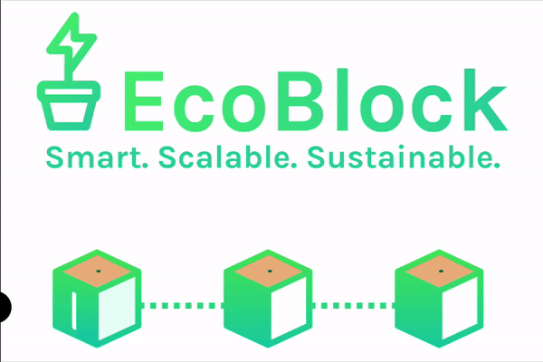

# EcoBlock
## **Simple, Scalable, and Sustainable Blockchain**

### **What is EcoBlock?**
Cryptocurrency uses countries worth of electricity, it is said it uses more energy per year than the UK! In order to solve this problem, EcoBlock was made. EcoBlock is a crypto currency which uses the growing concept of a Proof of Stake algorithm, rather than the current Proof of Work algorithm, to manage the blockchain. EcoBlock aims to reduce the environmental impact of cryptocurrency and incentivise minters who use green sources of energy. (In Proof of Stake crypto, users are called minters) 
### **Proof of Stake?**
A Proof of Stake uses a lottery system in order to validate the blockchain. Compared to the vigourus hash computations a Proof of Work must go through, a Proof of stake requires much less power in order to generate a hash for a block. 

### **Run Your Own Local EcoBlock BlockChain!**
1. Install Node.js if you haven't already
2. Clone the Repo and navigate to `/EcoChainNode`
3. `npm install` to install dependancies (Only have to do this once)

**Windows Users** \
There is a `.bat` file called `nodeInit.bat` to somewhat automate the node server creation. Run that and follow the prompts, it is important that the `HTTP Port`, `P2P Port`, and `Private Key File Name` are different for all nodes. If there is no input the prompts will take a default value. `EcoBoost` is a setting that will turn on a setting proving you use green energy.
| Prompt           | Input                                                                           |
|------------------|---------------------------------------------------------------------------------|
| HTTP Port        | Some 4 digit number (Ex. 3000, 3001 ...) **DEFAULT: 3001**                      |
| P2P Port         | Some 4 digit number (Ex. 6000, 6001 ...) **DEFAULT: 6001**                      |
| Private Key File | File name that will store the private key for this node **DEFAULT: private_key**|

**Linux/Mac** \
You have to set Environment Variables for the servers to run before `npm start`
|Variable | Value |
| ------ | ------| 
| HTTP_PORT | Some 4 digit number (Ex. 3000, 3001 ...) **DEFAULT: 3001** |
| P2P_PORT | Some 4 digit number (Ex. 6000, 6001 ...) **DEFAULT: 6001** |
| WALLETFNAME | First name to tag to this node (**Optional**) |
| WALLETLNAME | Last name to tag to this node (**Optional**)|
| PRIVATE_KEY | file path for the private key, will create new file if it does not exist: `PRIVATE_KEY=node/wallet/fileName` **DEFAULT: node/wallet/private_key**|
|ECOBOOST | `"true"` if on, anything else if false **DEFAULT: false**|

**With this you can start up as many nodes as you want!**

### **Interact with EcoBlock!**
With the nodes set up, you can interact with them using a python program `nodeTester.py`. Navigate to `/EcoChainNode` and run `nodeTester.py`. Start by adding the Ports of your nodes by typing `bulk` and adding them all in. You can manually change nodes by typing `c` or load a saved node using `load`. Now start connecting your nodes together by typing `8` on any node to add a peer, and keep adding all your other nodes, remember to use your P2P Port. (Depeding on what port # you selected the nodes might have already connected via automatic peer finding)

### Source
https://naivecoinstake.learn.uno/

